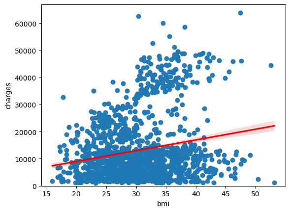
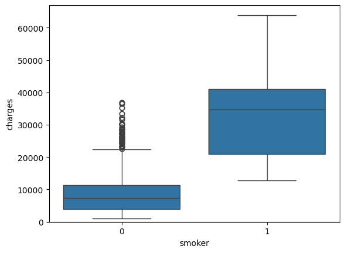
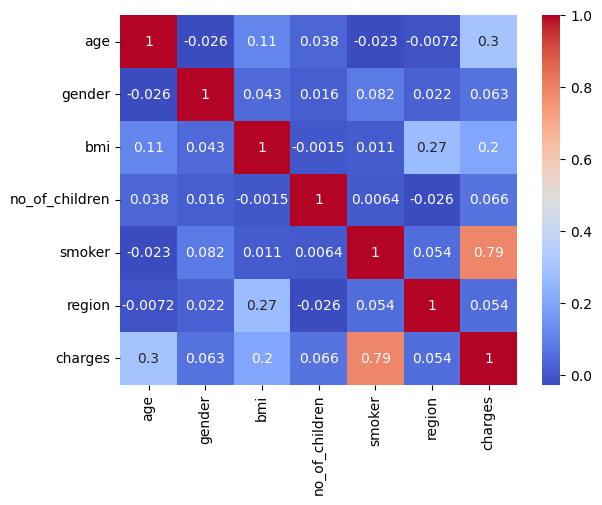

# Medical Insurance Cost Analysis and Prediction

**Exploring the factors associated with medical insurance charges and predicting costs using regression models.**

## Overview

What factors are associated with higher medical insurance charges, and how accurately can those charges be estimated using machine learning?

This project investigates the relationship between insurance charges and personal characteristics such as age, body mass index (BMI), smoking status, and geographic region.

Using Python and scikit-learn, the analysis progresses from data cleaning and exploratory analysis to linear regression, polynomial feature engineering, and Ridge regression.

## Dataset

The project uses a medical insurance dataset provided through IBM's Data Analysis with Python coursework.

The dataset contains **2,772 records** and seven attributes:

| Attribute | Description |
|---|---|
| Age | Individual's age |
| Gender | Encoded gender category |
| BMI | Body mass index |
| Number of children | Number of dependents |
| Smoker | Encoded smoking status |
| Region | Encoded US geographic region |
| Charges | Medical insurance charges in USD |

The objective is to predict the `charges` variable using the remaining attributes.

## Data Preparation

Before developing predictive models, the dataset was prepared through several cleaning operations:

- Assigned descriptive column names to the imported dataset
- Replaced missing-value placeholders with NaN
- Imputed missing age values using the mean
- Imputed missing smoking-status values using the most frequent category
- Converted numerical columns to appropriate data types
- Rounded insurance charges to two decimal places

These steps prepared the data for exploratory analysis and regression modeling.

## Exploratory Data Analysis

### BMI and Insurance Charges

A regression scatterplot was used to investigate the relationship between BMI and insurance charges.

The analysis identified a positive but relatively weak correlation of approximately **0.200**.

This suggests that BMI alone does not explain much of the variation in insurance charges within the dataset.

### Smoking Status and Insurance Charges

A boxplot was used to compare insurance charges across smoking-status categories.

The analysis revealed substantial differences between the groups, suggesting that smoking status is an important factor associated with insurance charges.

### Correlation Analysis

A correlation matrix was generated to compare the relationships between numerical attributes and insurance charges.

| Attribute | Correlation with charges |
|---|---:|
| Smoker | 0.789 |
| Age | 0.299 |
| BMI | 0.200 |
| Number of children | 0.066 |
| Gender | 0.063 |
| Region | 0.054 |

**Key finding:** Smoking status exhibited the strongest correlation with charges among the attributes examined, followed by age and BMI.

These are associations within the dataset rather than evidence of independent causal effects.

## Regression Model Development

### Simple Linear Regression

A baseline linear regression model was trained using smoking status as the only predictor.

**R²: 0.622**

This model explained approximately 62.2% of the variation in insurance charges in the training data used for fitting and scoring.

### Multiple Linear Regression

A second model incorporated all six predictor attributes.

**R²: 0.750**

Including additional features improved the model's in-sample fit compared with using smoking status alone.

### Polynomial Regression Pipeline

A scikit-learn pipeline was created using:

1. StandardScaler
2. PolynomialFeatures
3. LinearRegression

The pipeline allowed the model to account for nonlinear relationships and interactions between input features.

**R²: 0.845**

This was the highest in-sample R² reported during the model development stage.

## Model Refinement and Testing

The dataset was subsequently divided into training and testing subsets, with 20% reserved for testing.

Two Ridge regression configurations were evaluated.

| Model | Test R² |
|---|---:|
| Ridge Regression | 0.676 |
| Polynomial Ridge Regression (degree 2) | 0.784 |

The polynomial Ridge model achieved the stronger test-set result in this experiment.

This demonstrates how polynomial feature transformations can improve a regularized regression model's ability to represent relationships in the data.

The reported results are specific to the dataset and train/test split used in the notebook.

## Key Findings

- Smoking status had the strongest observed correlation with insurance charges.
- Multiple linear regression achieved a higher in-sample R² than the single-feature baseline.
- Polynomial feature engineering improved model fit in the development exercises.
- The second-degree polynomial Ridge model outperformed the standard Ridge model on the held-out test set.

## Technologies Used

- **Python** — Analysis and model development
- **Pandas & NumPy** — Data cleaning and numerical operations
- **Matplotlib & Seaborn** — Statistical visualization
- **scikit-learn** — Linear regression, Ridge regression, preprocessing pipelines, and model evaluation
- **Jupyter Notebook** — Interactive development

## Skills Demonstrated

- Data cleaning and missing-value imputation
- Exploratory data analysis
- Correlation analysis
- Statistical visualization
- Simple and multiple linear regression
- Feature scaling and polynomial transformations
- Machine learning pipelines
- Ridge regularization
- Train/test splitting
- Regression evaluation using R²

## Project Context

This project was completed as a guided practice exercise through IBM's Data Analysis with Python coursework.

It demonstrates foundational data analysis and regression modeling techniques using historical insurance data. The models are educational examples and are not intended for real-world insurance underwriting or pricing decisions.
